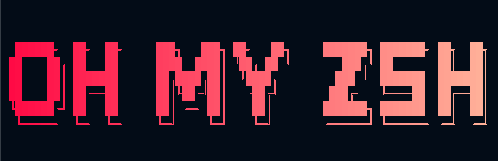

<p align="center">
  
</p>

# 🎩 What is Oh My Zsh and Why You’ll Love It

Hey there! 👋
If you've been using the terminal for a while — especially if you're a fan of `zsh` — then chances are you’ve heard of **Oh My Zsh**. But what _is_ it exactly? And why does everyone seem to love it?

Let me break it down in simple terms, from one curious terminal tweaker to another. 😄

---

## 🧠 So... What is Oh My Zsh?

**Oh My Zsh** is an open-source, community-driven framework for managing your **Zsh configuration**.

Zsh itself is a shell — kind of like Bash, but with more features and flexibility. It’s often used by developers who want a better command-line experience.

Now, Zsh by itself is already powerful, but Oh My Zsh adds a **ton of useful features out of the box**:

- 🚀 Beautiful themes
- 🔌 A bunch of helpful plugins
- ⚙️ A powerful configuration setup
- 💻 Productivity enhancements (like smart suggestions, syntax highlighting, etc.)

So basically, Oh My Zsh makes your terminal:

- more **beautiful**
- more **intelligent**
- and way more **fun to use**.

---

## ✨ Why Use Oh My Zsh?

Here are a few reasons why it’s worth installing:

- 🎨 **Customizable themes**: Your terminal can look really cool (Powerlevel10k is a fan favorite).
- ⚡ **Command autosuggestions**: Like your shell reads your mind.
- 📦 **Huge plugin ecosystem**: Git, npm, Docker, system tools, aliases — all ready to go.
- 🧠 **Smart shortcuts**: Do more with fewer keystrokes.
- 🛠️ **Easy to configure**: Just edit one file `.zshrc`.

Even if you’re not a terminal ninja, it makes the shell experience _less boring_ and a lot more helpful.

---

## 🧰 How to Install Oh My Zsh (Step-by-Step)

Let’s get to the good stuff. Here’s how to install and use Oh My Zsh on any system that supports Zsh — including **Termux on Android**.

### 🟢 Step 1: Install Zsh

On **Termux**:

```bash
pkg install zsh
```

On **Ubuntu/Debian**:

```bash
sudo apt install zsh
```

---

### 🟢 Step 2: Make Zsh Your Default Shell (Optional but recommended)

```bash
chsh -s zsh
```

You might need to log out and back in for this to take effect.

---

### 🟢 Step 3: Install Oh My Zsh

The easiest way is with this command (requires curl or wget and git):

```bash
sh -c "$(curl -fsSL https://raw.githubusercontent.com/ohmyzsh/ohmyzsh/master/tools/install.sh)"
```

Or using wget:

```bash
sh -c "$(wget https://raw.githubusercontent.com/ohmyzsh/ohmyzsh/master/tools/install.sh -O -)"
```

This script will:

- Create the `~/.oh-my-zsh/` folder
- Set up a default `.zshrc` file
- Launch Zsh with your new configuration

---

## 🖼️ Themes and Plugins: The Fun Part

### 🎨 Change the Theme

In your `.zshrc` file, look for the line:

```bash
ZSH_THEME="robbyrussell"
```

Change it to any theme you like, for example:

```bash
ZSH_THEME="agnoster"
```

Or if you install Powerlevel10k later:

```bash
ZSH_THEME="powerlevel10k/powerlevel10k"
```

After changing, apply the config by running:

```bash
source ~/.zshrc
```

---

### 🔌 Enable Plugins

In your `.zshrc`, find this line:

```bash
plugins=(git)
```

You can add more plugins like this:

```bash
plugins=(git docker node npm autojump)
```

Then reload the config:

```bash
source ~/.zshrc
```

---

## 🧪 Cool Features You Get Instantly

- `gst` → shortcut for `git status`
- `ll` → shortcut for `ls -l`
- `..` → goes up one directory
- `z` → jumps to frequently used directories
- **Autosuggestions** and **syntax highlighting** (with extra plugins)
- Tons of Git aliases and shortcuts built in

---

## 🧠 Final Thoughts

Honestly, using Oh My Zsh made my command-line experience _way more enjoyable_. I didn’t realize how much time I was wasting typing repetitive stuff until I started using it.

If you love customizing your tools, enjoy being more productive, or just want your terminal to look awesome, **give Oh My Zsh a try**. You won’t regret it.

And if you want to dive deeper, check out the official repo on GitHub:
👉 [https://github.com/ohmyzsh/ohmyzsh](https://github.com/ohmyzsh/ohmyzsh)

Happy hacking! 💻🚀
